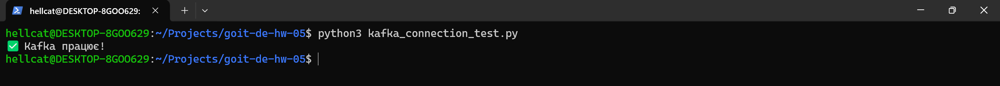

# 🚀 Kafka Sensor Data Processing

This project implements a real-time sensor data processing system using Apache Kafka.  
A producer generates sensor data, which is processed and stored in dedicated topics.

## 📦 **Project Structure**
```bash
├── kafka_config.py          # Kafka configuration (server, username, password)
├── alerts_conditions.csv     # Alert conditions configuration file
├── kafka_connection_test.py # Script to check connection with the Server
├── delete_topics.py      # Reset Kafka Topics (if needed)
├── 01_kafka_create_topics.py   # Script to create Kafka topics
├── 02_sensor_data_producer.py  # Producer that generates sensor data
├── 03_sensor_alert_processor.py  # Processor that analyzes sensor data and generates alerts
├── 04_alerts_consumer.py       # Consumer that listens for temperature and humidity alerts
├── 05_sliding_window_processor.py  # New processor to implement sliding window and generate alerts


```


📌 Features:

- ✅ Sends simulated sensor data to Kafka
- ✅ Detects critical temperature and humidity values
- ✅ Generates alerts when threshold values are exceeded
- ✅ Listens for alerts via a consumer

🔥 New Features in This Version
- ✅ Sliding Window Aggregation – Calculates average temperature and humidity using a 1-minute window with a 30-second slide interval for real-time monitoring.
- ✅ Dynamic Alert Conditions – Alerts are now dynamically loaded from alerts_conditions.csv, allowing easy updates without modifying the code.
- ✅ Multiple Alert Conditions – The system checks sensor data against multiple alert thresholds (e.g., too hot, too cold, too dry, too humid).
- ✅ Automated Filtering & Alerting – Cross-checks aggregated values with conditions and sends alerts only when thresholds are exceeded.
- ✅ Kafka Topic-Based Processing – Uses dedicated Kafka topics:
building_sensors_hellcat_topic – Receives raw sensor data
alerts_hellcat_topic – Stores processed alerts
- ✅ Efficient Data Handling – Implements buffered message processing and auto-cleanup of outdated data from the aggregation window.
- ✅ Auto-Commit for Kafka Consumers – Ensures each message is processed and committed to prevent duplicate processing.
- ✅ Scalability – Multiple sensor producers and processors can run simultaneously without conflicts.

## 🔍 Checking the Connection with the Server

Run the following command to test the Kafka connection:
``` bash
python3 kafka_connection_test.py
```



## 🚀 How to Run the Project

1️⃣ Create Kafka Topics

``` bash
python3 01_kafka_create_topics.py
```


❌ Reset Kafka Topics (if needed)

``` bash
python3 delete_topics.py
```


2️⃣ Start the Producer (Simulating Sensor Data)

``` bash
python3 02_sensor_data_producer.py
```


3️⃣ Start the Data Processor (Generates Alerts)

``` bash
python3 03_sensor_alert_processor.py
```


4️⃣ Start the Alerts Consumer

``` bash
python3 04_alerts_consumer.py
```


