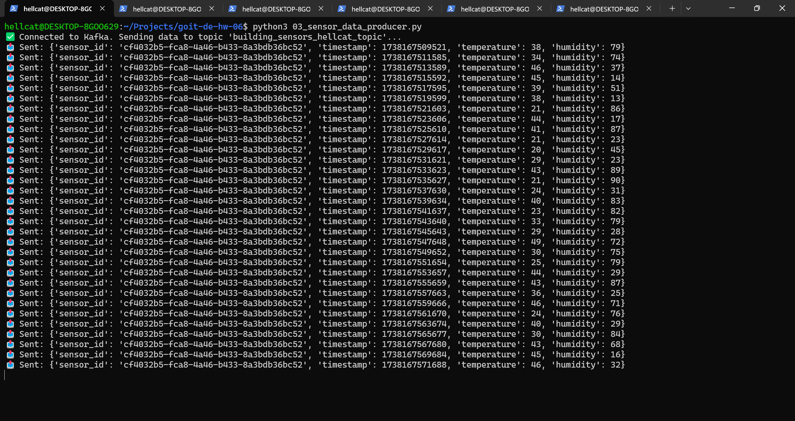
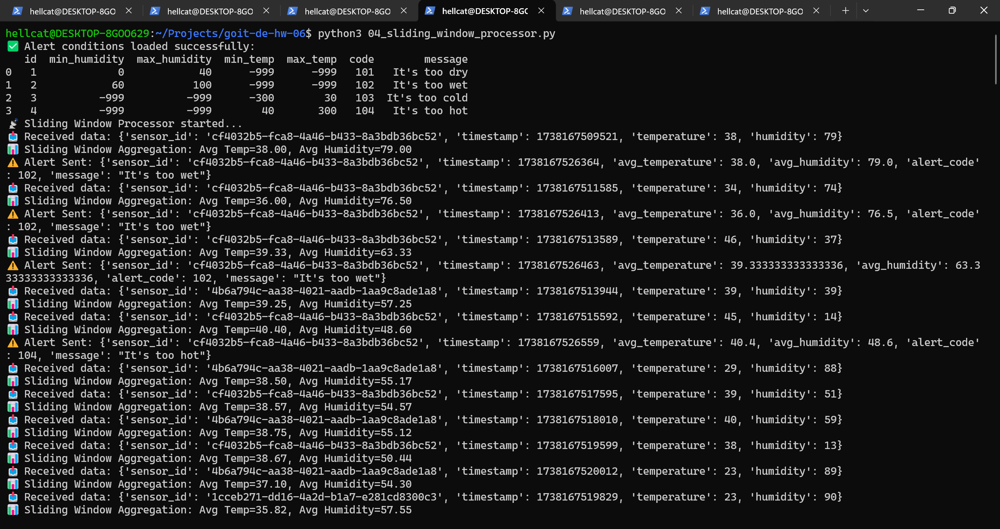
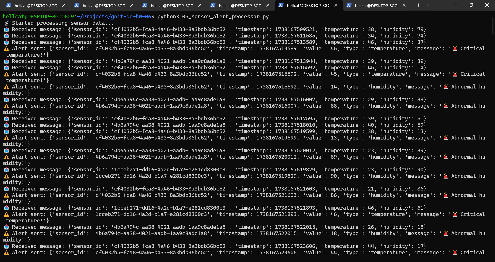
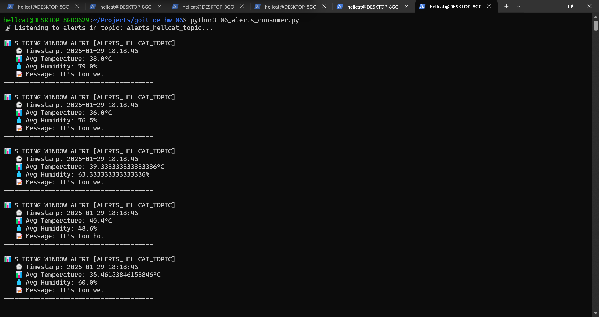
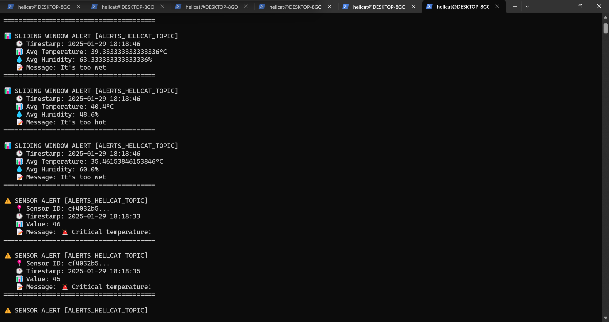

# 🚀 Kafka Sensor Data Processing

This project implements a real-time sensor data processing system using Apache Kafka.  
A producer generates sensor data, which is processed and stored in dedicated topics.

## 📦 **Project Structure**
```bash
├── kafka_config.py          # Kafka configuration (server, username, password)
├── alerts_conditions.csv     # Alert conditions configuration file
├── kafka_connection_test.py # Script to check connection with the Server
├── 01_kafka_create_topics.py   # Script to create Kafka topics
├── 02_delete_topics.py      # Reset Kafka Topics (if needed)
├── 03_sensor_data_producer.py  # Producer that generates sensor data
├── 04_sliding_window_processor.py  # New processor to implement sliding window and generate alerts
├── 05_sensor_alert_processor.py  # Processor that analyzes sensor data and generates alerts
├── 06_alerts_consumer.py       # Consumer that listens for temperature and humidity alerts
```


📌 Features:

- ✅ Sends simulated sensor data to Kafka
- ✅ Detects critical temperature and humidity values
- ✅ Generates alerts when threshold values are exceeded
- ✅ Listens for alerts via a consumer

🔥 New Features in This Version
- ✅ Sliding Window Aggregation – Calculates average temperature and humidity using a 1-minute window with a 30-second slide interval for real-time monitoring.
- ✅ Dynamic Alert Conditions – Alerts are now dynamically loaded from alerts_conditions.csv, allowing easy updates without modifying the code.
- ✅ Multiple Alert Conditions – The system checks sensor data against multiple alert thresholds (e.g., too hot, too cold, too dry, too humid).
- ✅ Automated Filtering & Alerting – Cross-checks aggregated values with conditions and sends alerts only when thresholds are exceeded.
- ✅ Kafka Topic-Based Processing – Uses dedicated Kafka topics:
building_sensors_hellcat_topic – Receives raw sensor data
alerts_hellcat_topic – Stores processed alerts
- ✅ Efficient Data Handling – Implements buffered message processing and auto-cleanup of outdated data from the aggregation window.
- ✅ Auto-Commit for Kafka Consumers – Ensures each message is processed and committed to prevent duplicate processing.
- ✅ Scalability – Multiple sensor producers and processors can run simultaneously without conflicts.

## 🔍 Checking the Connection with the Server

Run the following command to test the Kafka connection:
``` bash
python3 kafka_connection_test.py
```


## 🚀 How to Run the Project

1️⃣ Create Kafka Topics

``` bash
python3 01_kafka_create_topics.py
```


❌ Reset Kafka Topics (if needed)

``` bash
python3 02_delete_topics.py
```


2️⃣ Start the Sensor Data Producer
This script generates simulated sensor data and sends it to Kafka.

``` bash
python3 03_sensor_data_producer.py
```


3️⃣ Start the Sliding Window Aggregator
This process calculates the average temperature and humidity over a 1-minute sliding window.

``` bash
python3 04_sliding_window_processor.py

```


4️⃣ Start the Alerts Consumer
This script checks aggregated sensor data against alert thresholds and sends alerts.

``` bash
python3 05_sensor_alert_processor.py
```


5️⃣ Start the Alerts Consumer
This script listens for temperature and humidity alerts from Kafka.

``` bash
python3 06_alerts_consumer.py
```



💡 Notes:

- Make sure Kafka is running before starting the scripts.
- The alert conditions are loaded from alerts_conditions.csv dynamically.
- Multiple instances of sensor producers and processors can run simultaneously.

This updated How to Run section now includes the new Sliding Window Processor and ensures the correct script order for execution. 🚀